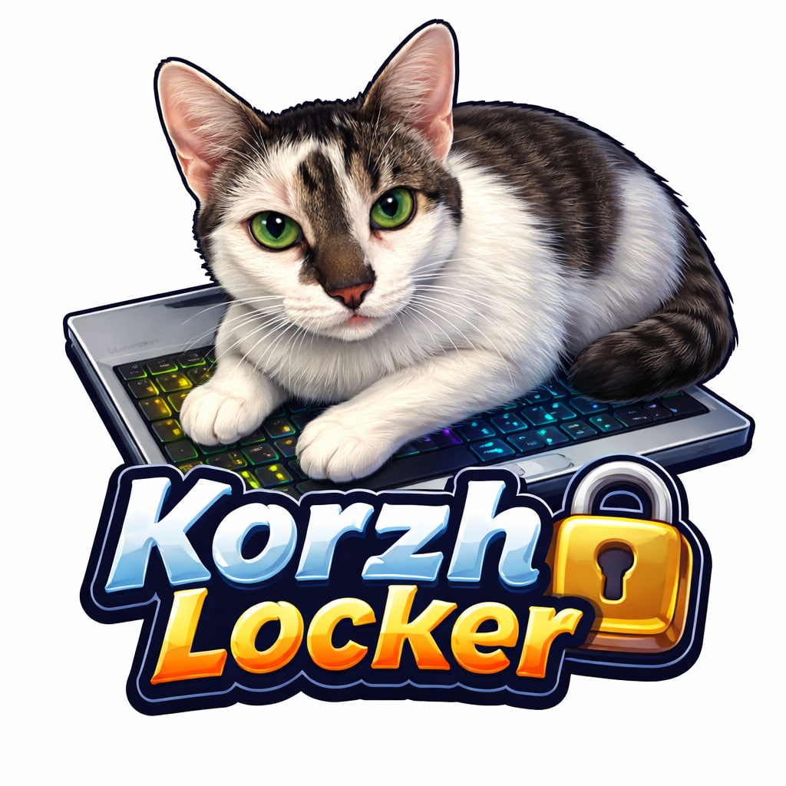

# KorzhLocker

- [EN](#About-EN)
- [RU](#About-RU)

## About EN

A simple program to protect your computer from accidental clicks by a cat when you need to leave your workplace.

### 😼 About the program

The idea is inspired by the CatLock program, the principle of operation is the same:
- Run the program
- Be sure that the keyboard is safe.
- Remove the lock by clicking on the program window (it will hide in the tray)
- In the tray, you can use the context menu to show the lock window again or close the program.

### ⚙️ How does it work?

1. The program window is located on top of other windows and takes over the input focus.
2. If focus is lost, focus is forcibly transferred to the program window again.
3. Keystrokes and closing attempts are detected and blocked (except for some system keys).

### ❓ Questions and answers

Q: Is it free? \
A: Completely. \
Q: Do you need registration? \
A: No. \
Q: Is there an advertisement? \
A: No. \
Q: Does the program collect or send any data to the developer? \
A: No, the entire code is open - you can verify this yourself. \
Q: Is it possible to close the program window using Ctrl+F4? \
A: No, the hacker cat has no chance here. \
Q: Will the program help by pressing the laptop's power button? \
A: No, because it is technically impossible.

## About RU

Простая программа для защиты компьютера от случаных нажатий кошкой, когда вам нужно отойти от рабочего места.

### 😼 О программе

Идея навеяна программой **CatLock**, принцип работы тот же:
1. Запустите программу
2. Будьте уверены, что клавиатура в безопасности
3. Снимите блокировку, сделав клик по окну программы (скроется в трей)
4. В трее через контекстное меню можно снова показать окно блокировки или закрыть программу

### ⚙️ Как это работает?

1. Окно программы находится поверх друг окон и берет фокус ввода на себя
2. При потере фокуса, фокус снова принудительно передается окну программы
3. Нажатия клавиш и попытки закрытия отлавливаются и блокируются (кроме некоторых системных клавиш).

### ❓ Вопросы и ответы

В: Это бесплатно? \
О: Полностью. \
В: Нужна регистрация? \
О: Нет. \
В: Есть реклама? \
О: Нет. \
В: Программа собирает или отправляет какие-то данные разработчику? \
О: Нет, весь код открыт - можно убедиться в этом самостоятельно. \
В: Можно ли закрыть окно программы через Ctrl+F4? \
О: Нет, у кота-хакера здесь нет шансов. \
В: Поможет ли программа от нажатия на кнопку питания ноутбука? \
О: Нет, потому что это невозможно технически.
